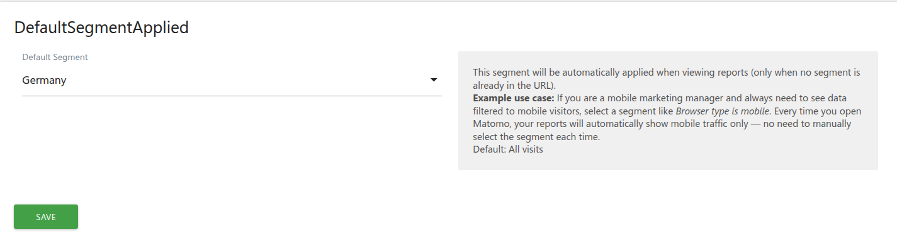

# Default Segment Applied

A [Matomo](https://matomo.org) plugin that allows users to set a default segment automatically applied when viewing reports.

## Description

When configured, the selected segment is automatically applied to all report pages, saving users from having to manually select their preferred segment each time they access Matomo. The segment is applied transparently via the URL and respects manually selected segments — it only activates when no segment is already present in the URL.

This is a **per-user setting**: each authenticated user can choose their own default segment independently.

## Features

- Set a default segment from your Personal Settings page
- Segment is automatically applied when viewing any report
- Does not override manually selected segments (only applies when no segment is in the URL)
- Works with all saved segments available to the user
- Detects when the default segment setting changes and transitions gracefully
- Per-user preference — does not affect other users
- Multilingual support (English, French)

## Use Cases

Here are practical scenarios where DefaultSegmentApplied saves time and streamlines your workflow:

### 1. Mobile Marketing Manager

You are responsible for mobile acquisition and only care about mobile visitors. You create a segment **"Browser type is mobile"** and set it as your default. Every time you open Matomo, all reports automatically show mobile traffic — no manual selection needed.



### 2. Regional Sales Team

Your sales team is split by geography. Each regional manager creates a segment for their country (e.g., **"Country is France"**) and sets it as their default. When they log in, they immediately see data relevant to their region without having to remember to apply a filter.

### 3. Campaign Analyst

You are tracking a long-running campaign and need to monitor visitors who arrived via a specific campaign tag. You set a segment like **"Campaign name is summer_2025"** as your default. For the duration of the campaign, every report you open is pre-filtered to that campaign's traffic.

### 4. E-commerce Product Owner

You manage a specific product category and want to focus on visitors who viewed products in that category. By setting a segment such as **"Product category is Electronics"**, all your dashboards and reports reflect only the audience you care about.

### 5. QA / Internal Traffic Exclusion

Your QA team browses the site frequently and skews the data. You create a segment **"Visitor IP is not 192.168.1.0/24"** to exclude internal traffic and set it as your default. Now every report you view automatically excludes QA visits.

> **Tip:** You can change or remove your default segment at any time from **Administration > Personal > Settings**. Selecting **"All Visits"** disables the automatic filter. Manually selecting a different segment in the segment bar always takes priority over the default.

## Screenshots

Screenshots illustrating the plugin's features are located in the [`screenshots/`](screenshots/) directory. If you are a contributor, please add annotated screenshots showing:

1. The **Default Segment** dropdown in Personal Settings
2. A report page with the default segment automatically applied
3. The segment bar showing the auto-applied segment

## Requirements

- Matomo >= 5.0.0, < 6.0.0
- The [SegmentEditor](https://matomo.org) plugin must be active (ships with Matomo by default)
- At least one saved segment must exist for the dropdown to show options

## Installation

### From the Marketplace

1. Go to **Administration > Platform > Marketplace**
2. Search for **DefaultSegmentApplied**
3. Click **Install**
4. Activate the plugin

### Manual Installation

1. Download or clone this repository into your Matomo `plugins/` directory:
   ```
   cd /path/to/matomo/plugins
   git clone https://github.com/Chardonneaur/DefaultSegmentApplied.git
   ```
2. Ensure the folder is named `DefaultSegmentApplied`
3. Go to **Administration > Platform > Plugins**
4. Activate **DefaultSegmentApplied**

## Usage

1. Navigate to **Administration > Personal > Settings**
2. Find the **DefaultSegmentApplied** section
3. Select a segment from the **Default Segment** dropdown
4. Click **Save**

From now on, when you view any report without a segment specified, your default segment will be automatically applied.

To remove the default segment, select **All Visits** from the dropdown and save.

## How It Works

### Server Side

When a page loads, the plugin hooks into `Template.jsGlobalVariables` and injects the user's default segment definition into the JavaScript global `piwik.defaultSegment` variable. The value is JSON-encoded with full hex-entity escaping (`JSON_HEX_TAG | JSON_HEX_AMP | JSON_HEX_APOS | JSON_HEX_QUOT`) and is validated against the current list of available segments before being rendered.

### Client Side

A JavaScript module (`defaultSegmentApplier.js`) runs on page load and:

1. Reads `piwik.defaultSegment` (set by the server).
2. Checks whether a segment is already present in the URL (hash or query string).
3. If no segment is in the URL, navigates to the current page with the default segment applied via Matomo's `broadcast.propagateNewPage()` API.
4. Stores the current default segment in `localStorage` to detect setting changes across sessions and handle transitions gracefully (e.g., switching from one default segment to another).

### Validation

- On save, the segment value is validated against the whitelist of segments returned by `SegmentEditorAPI::getAll()`.
- On render, the segment existence is re-checked to handle segments that may have been deleted since the setting was saved.
- Anonymous users are excluded on both the server side and client side.

## File Structure

```
DefaultSegmentApplied/
├── DefaultSegmentApplied.php   # Main plugin class (event hooks)
├── UserSettings.php            # User setting definition and validation
├── javascripts/
│   └── defaultSegmentApplier.js  # Client-side segment application logic
├── lang/
│   ├── en.json                 # English translations
│   └── fr.json                 # French translations
├── screenshots/                # Screenshots for Marketplace display
├── docs/
│   └── faq.md                  # FAQ tab on the Marketplace
├── CHANGELOG.md                # Changelog tab on the Marketplace
├── plugin.json                 # Plugin metadata
├── LICENSE                     # GPL v3
└── README.md                   # This file
```

## Security

This plugin has been audited for common web vulnerabilities:

- **XSS Prevention**: The segment value injected into inline JavaScript uses `json_encode` with all four `JSON_HEX_*` flags, preventing script breakout. On the client side, all values are passed through `encodeURIComponent()` before being used in URLs.
- **Input Validation**: A strict whitelist approach is used — only segment definitions returned by the SegmentEditor API are accepted. Validation occurs both at save time and at render time.
- **Access Control**: Anonymous users are excluded on both the server (`Piwik::isUserIsAnonymous()`) and client (`piwik.userLogin === 'anonymous'`) sides. The Matomo `UserSettings` framework restricts settings to authenticated users.
- **Error Handling**: Exceptions are caught and logged without leaking internal details.

## Contributing

Contributions are welcome! Please open an issue or submit a pull request on [GitHub](https://github.com/Chardonneaur/DefaultSegmentApplied).

### Adding Translations

To add a new language, create a JSON file in the `lang/` directory following the format of `lang/en.json`. The keys are:

| Key | Description |
|-----|-------------|
| `DefaultSegmentApplied_PluginDescription` | Short plugin description |
| `DefaultSegmentApplied_DefaultSegment` | Label for the setting |
| `DefaultSegmentApplied_NoDefaultSegment` | Label when no segment is set |
| `DefaultSegmentApplied_Description` | Description text shown under the setting |
| `DefaultSegmentApplied_InlineHelp` | Use case example shown as inline help next to the setting |

## License

This plugin is licensed under the [GNU General Public License v3.0](https://www.gnu.org/licenses/gpl-3.0.html) or later.

## Author

[Chardonneaur](https://github.com/Chardonneaur)
